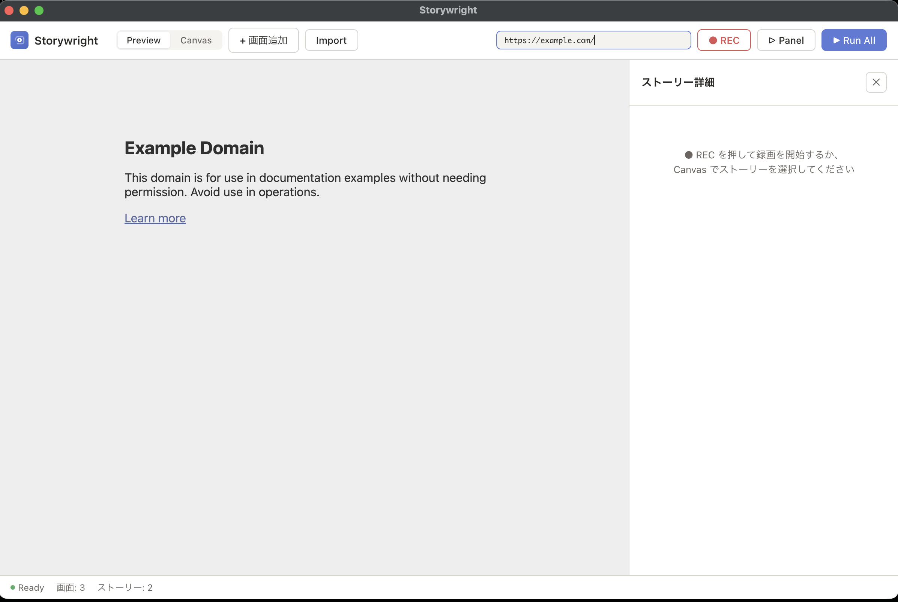

<p align="center">
  
</p>

# Storywright

ブラウザ操作を記録して、そのまま E2E テストとして実行できる Electron デスクトップアプリ。

<p align="center">
  
</p>

## ダウンロード

[最新版をダウンロード（macOS）](https://github.com/t-naka-mura/storywright/releases/latest)

### インストール手順

1. 上のリンクから `.dmg` ファイルをダウンロードします
2. ダウンロードした `.dmg` をダブルクリックして開きます
3. 「Storywright」を「Applications」フォルダにドラッグ＆ドロップします
4. 初回起動時は Finder で Storywright を**右クリック →「開く」**を選んでください（署名なしアプリのため通常のダブルクリックではブロックされます）
5. 確認ダイアログが出たら「開く」をクリックします（2回目以降は通常どおり起動できます）

## スタック

- **フロントエンド**: React 19 + TypeScript + Vite
- **バックエンド**: Electron (Node.js)
- **E2Eテスト**: CDP (Chrome DevTools Protocol) で Preview webview 上に直接実行
- **パッケージマネージャ**: pnpm

## セットアップ

```bash
pnpm install
```

## 開発モードで起動

```bash
pnpm dev
```

Vite の開発サーバーと Electron が同時に起動します。

## 本番ビルド

```bash
pnpm build
```

## リリース

tag を push すると GitHub Actions が macOS 向け dmg を自動ビルドし、GitHub Releases にアップロードします。

```bash
git tag v0.x.x
git push origin v0.x.x
```

## プロジェクト構成

```
src/           # React フロントエンド
electron/      # Electron main process + preload
e2e/           # E2E テスト（Playwright + Electron）
docs/ai/       # 設計ドキュメント・仕様・ADR
public/        # 静的アセット
```

## テスト

```bash
pnpm vitest run          # ユニットテスト
pnpm build && pnpm test:e2e   # E2E テスト（ビルド後に実行）
```

## 推奨エディタ

- [VS Code](https://code.visualstudio.com/)
